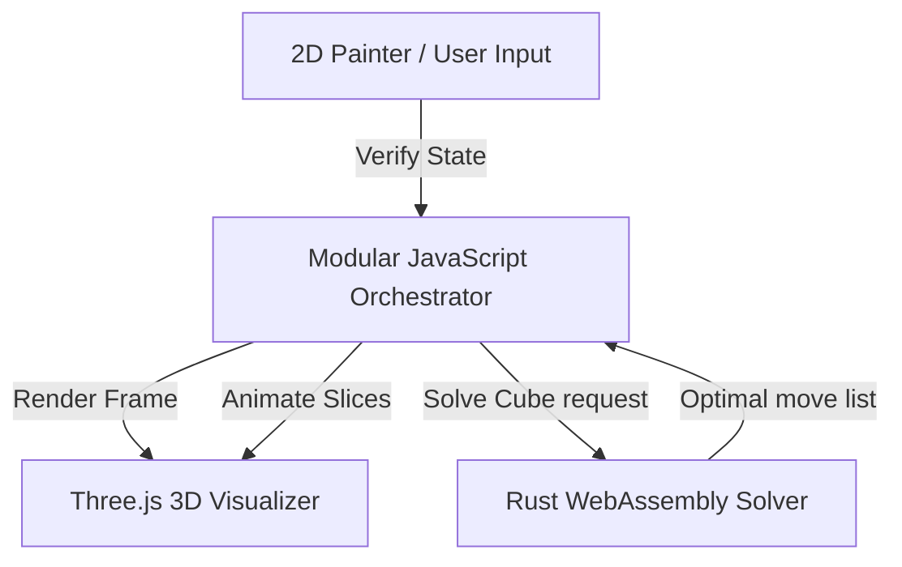

# High-Performance Rubik's Cube Solver with Rust, WebAssembly & Three.js

I built **cube-solver-wasm**, a web application that compiles a Rust implementation of Kociemba's algorithm to WebAssembly, paired with a hardware-accelerated 3D viewer built with Three.js.

The live demo is available at [dmachard.github.io/cube-solver-wasm](https://dmachard.github.io/cube-solver-wasm/), and you can check out the source code on [GitHub](https://github.com/dmachard/cube-solver-wasm).

---

## Architecture Breakdown

To achieve a seamless user experience, the project separates heavy logic computation from user interface rendering:

### 1. The Core Solver (Rust & Wasm)
Rust provides memory safety and native-speed execution. By utilizing `wasm-pack`, the Rust implementation of Kociemba's algorithm compiles down to a compact, highly optimized binary file. The orchestrator loads this module as an ES6 import, allowing instant function calls from JavaScript with negligible overhead.

### 2. The 3D Rendering (Three.js)
The cube is rendered as an interactive 3D object. Users can:
*   Rotate the viewport to inspect faces.
*   Trigger animations for slice rotations.
*   Interact using mouse or touch controls.
